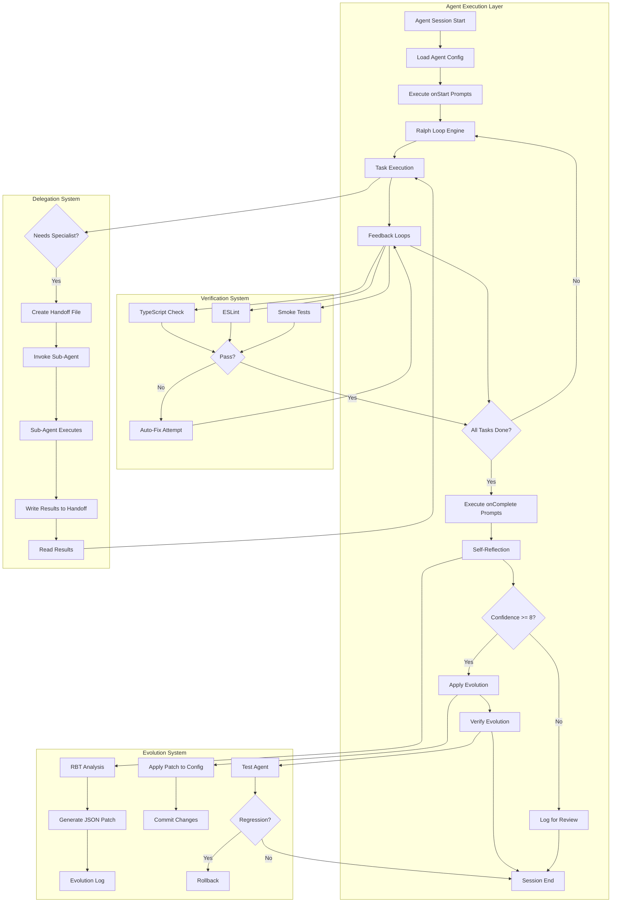

# Design Document: Agent-Prompt Integration System

## Overview

This design document describes the architecture and implementation of an Agent-Prompt Integration System that creates formal bindings between agents and prompts, enables self-evolution through automated improvements, and integrates Playwright verification into the agent workflow. The system incorporates Ralph Loop methodology for autonomous iteration and the Kiro Evolution Protocol for self-improvement guardrails.

The system consists of five major subsystems:
1. **Agent-Prompt Binding System** - Formal mappings between agents and their prompts
2. **Evolution System** - Self-reflection and automated improvement application
3. **Verification System** - Playwright test integration for code quality assurance
4. **Delegation System** - Structured handoff protocol for sub-agent workflows
5. **Ralph Loop Engine** - Autonomous iteration with feedback loops

## Architecture



## Components and Interfaces

### 1. Agent Configuration Schema

The agent configuration JSON schema is extended to include prompt bindings, Ralph Loop settings, and hooks:

```typescript
interface AgentConfig {
  name: string;
  description: string;
  prompt: string;
  model: string;
  tools: string[];
  allowedTools: string[];
  resources: string[];
  toolsSettings?: Record<string, unknown>;
  
  // Ralph Loop settings
  completion?: string;           // e.g., "<promise>DONE</promise>"
  max_iterations?: number;       // Default: 25
  
  // Prompt bindings (NEW)
  prompts?: {
    onStart: string[];           // Prompts to run at session start
    onComplete: string[];        // Prompts to run at task completion
    available: string[];         // Prompts agent can invoke
    autoTrigger?: {
      afterWrite?: string[];     // Prompts after file write
      afterError?: string[];     // Prompts after error
    };
  };
  
  // Hooks for automation (NEW)
  hooks?: {
    agentSpawn?: HookCommand[];
    preToolUse?: HookCommand[];
    postToolUse?: HookCommand[];
    stop?: HookCommand[];
  };
}

interface HookCommand {
  matcher?: string;              // Tool name to match (for pre/postToolUse)
  command: string;               // Shell command to execute
}
```

### 2. Prompt Binding System

```typescript
interface PromptBinding {
  promptName: string;            // e.g., "self-reflect"
  promptPath: string;            // e.g., ".kiro/prompts/self-reflect.md"
  triggerType: 'onStart' | 'onComplete' | 'available' | 'afterWrite' | 'afterError';
}

interface PromptExecutor {
  // Load and execute a prompt
  execute(promptName: string, context: ExecutionContext): Promise<PromptResult>;
  
  // Get all prompts for a trigger type
  getPromptsForTrigger(agentConfig: AgentConfig, trigger: string): string[];
  
  // Check if prompt exists
  exists(promptName: string): boolean;
}
```

### 3. Evolution System

```typescript
interface EvolutionEntry {
  sessionDate: string;
  description: string;
  context: {
    project: string;
    task: string;
    duration: string;
  };
  rbtAnalysis: {
    roses: string[];             // What worked well
    buds: string[];              // Improvement opportunities
    thorns: string[];            // Failures and friction
  };
  proposedChanges: {
    promptImprovements?: string[];
    toolRecommendations?: string[];
    resourceSuggestions?: string[];
  };
  confidenceScore: number;       // 1-10
  applied: boolean;
  appliedDate?: string;
}

interface EvolutionSystem {
  // Record a new evolution entry
  recordEvolution(agentName: string, entry: EvolutionEntry): Promise<void>;
  
  // Get high-confidence unapplied entries
  getApplicableEvolutions(agentName: string, minConfidence: number): Promise<EvolutionEntry[]>;
  
  // Apply evolution to agent config
  applyEvolution(agentName: string, entry: EvolutionEntry): Promise<ApplyResult>;
  
  // Rollback last applied evolution
  rollback(agentName: string): Promise<void>;
  
  // Verify evolution didn't cause regression
  verifyEvolution(agentName: string, testTask: string): Promise<VerifyResult>;
}

interface ApplyResult {
  success: boolean;
  patchApplied: JsonPatch;
  commitHash?: string;
  error?: string;
}
```

### 4. Verification System

```typescript
interface VerificationResult {
  status: 'pass' | 'fail' | 'flaky';
  testsRun: number;
  testsPassed: number;
  testsFailed: number;
  duration: number;              // milliseconds
  failureDetails?: FailureDetail[];
}

interface FailureDetail {
  testName: string;
  error: string;
  file: string;
  line: number;
}

interface VerificationSystem {
  // Run smoke tests (< 30 seconds)
  runSmokeTests(): Promise<VerificationResult>;
  
  // Run full test suite
  runFullTests(): Promise<VerificationResult>;
  
  // Run TypeScript type checking
  runTypeCheck(): Promise<TypeCheckResult>;
  
  // Run ESLint
  runLint(): Promise<LintResult>;
  
  // Run all feedback loops
  runFeedbackLoops(): Promise<FeedbackLoopResult>;
  
  // Diagnose failure with RCA prompt
  diagnoseFailure(result: VerificationResult): Promise<DiagnosisResult>;
}
```

### 5. Delegation System

```typescript
interface Handoff {
  id: string;                    // Timestamp-based ID
  fromAgent: string;
  toAgent: string;
  task: string;
  fileRefs: string[];
  expectedOutput: string;
  successCriteria: string[];
  status: 'pending' | 'in_progress' | 'completed' | 'failed';
  results?: HandoffResult;
  createdAt: string;
  completedAt?: string;
}

interface HandoffResult {
  success: boolean;
  output: string;
  filesModified: string[];
  summary: string;
}

interface DelegationSystem {
  // Create a handoff file
  createHandoff(handoff: Omit<Handoff, 'id' | 'status' | 'createdAt'>): Promise<string>;
  
  // Read handoff for execution
  readHandoff(handoffId: string): Promise<Handoff>;
  
  // Complete a handoff with results
  completeHandoff(handoffId: string, results: HandoffResult): Promise<void>;
  
  // List pending handoffs for an agent
  getPendingHandoffs(agentName: string): Promise<Handoff[]>;
}
```

### 6. Ralph Loop Engine

```typescript
interface RalphLoopConfig {
  planFile: string;              // Default: "PLAN.md"
  progressFile: string;          // Default: "PROGRESS.md"
  activityLog: string;           // Default: "activity.log"
  completionSignal: string;      // Default: "<promise>DONE</promise>"
  maxIterations: number;         // Default: 25
  mode: 'hitl' | 'afk';          // Human-in-the-loop or Away-from-keyboard
}

interface TaskStatus {
  id: string;
  description: string;
  status: '🔄' | '🟡' | '✅' | '❌';  // PENDING, IN_PROGRESS, COMPLETED, FAILED
  assignedAgent?: string;
}

interface RalphLoopEngine {
  // Initialize loop with config
  initialize(config: RalphLoopConfig): Promise<void>;
  
  // Get next task to work on
  getNextTask(agentName: string): Promise<TaskStatus | null>;
  
  // Update task status
  updateTaskStatus(taskId: string, status: TaskStatus['status']): Promise<void>;
  
  // Check if all tasks complete
  isComplete(agentName: string): Promise<boolean>;
  
  // Log activity
  logActivity(message: string): Promise<void>;
  
  // Run single iteration (HITL mode)
  runOnce(agentName: string): Promise<IterationResult>;
  
  // Run loop until complete (AFK mode)
  runLoop(agentName: string): Promise<LoopResult>;
}
```

## Data Models

### Evolution Log File Structure

Location: `~/.kiro/evolution/[agent-name]-evolution.md`

```markdown
# [Agent Name] Evolution Log

## Session: [Date] - [Brief Description]

### Context
- Project: [project name]
- Task: [what was attempted]
- Duration: [approximate time]

### RBT Analysis

#### 🌹 Roses
- [What worked well]

#### 🌱 Buds
- [Improvement opportunities]

#### 🌵 Thorns
- [Failures and friction points]

### Proposed Changes

#### Prompt Improvements
```
[Specific prompt text to add/modify]
```

#### Tool Recommendations
- [Tools to add or configure differently]

#### Resource Suggestions
- [Files or patterns to include in context]

### Confidence Score
[1-10]

### Applied
[ ] Not yet applied
```

### Handoff File Structure

Location: `.kiro/handoffs/[timestamp]-[agent]-[task].md`

```markdown
# Handoff: [Task Name]

## Metadata
- **ID**: [timestamp-based ID]
- **From**: [orchestrator agent]
- **To**: [specialist agent]
- **Created**: [ISO timestamp]
- **Status**: pending | in_progress | completed | failed

## Task Description
[Detailed description of what needs to be done]

## File References
- `path/to/file1.ts`
- `path/to/file2.ts`

## Expected Output
[What the specialist should produce]

## Success Criteria
- [ ] Criterion 1
- [ ] Criterion 2
- [ ] Criterion 3

## Results
<!-- Filled by specialist agent -->
### Summary
[Brief summary of what was done]

### Files Modified
- `path/to/modified1.ts`
- `path/to/modified2.ts`

### Output
[Detailed output or findings]

### Completed At
[ISO timestamp]
```

### Progress File Structure

Location: `PROGRESS.md`

```markdown
# Progress Tracker

## Agent Assignments

### security-specialist
- 🔄 3.4: Security audit
- 🟡 3.5: Input validation
- ✅ 3.6: Rate limiting

### code-surgeon
- ✅ 2.1: Refactor API routes
- 🔄 2.2: Add error handling

## Status Legend
- 🔄 PENDING - Not started
- 🟡 IN_PROGRESS - Currently working
- ✅ COMPLETED - Done
- ❌ FAILED - Needs attention
```

### Smoke Test File Structure

Location: `tests/e2e/smoke.spec.ts`

```typescript
import { test, expect } from '@playwright/test';

test.describe('@smoke Critical Path Tests', () => {
  test('@smoke homepage loads correctly', async ({ page }) => {
    // Test implementation
  });

  test('@smoke Flash Scan flow works', async ({ page }) => {
    // Test implementation
  });

  test('@smoke Dashboard loads correctly', async ({ page }) => {
    // Test implementation
  });
});
```


## Correctness Properties

*A property is a characteristic or behavior that should hold true across all valid executions of a system—essentially, a formal statement about what the system should do. Properties serve as the bridge between human-readable specifications and machine-verifiable correctness guarantees.*

Based on the prework analysis, the following correctness properties have been identified and consolidated to eliminate redundancy:

### Property 1: Agent Configuration Parsing

*For any* valid agent configuration JSON containing a `prompts` section, the Agent_System SHALL correctly parse and recognize all fields: `onStart`, `onComplete`, `available`, and `autoTrigger` (with `afterWrite` and `afterError` sub-fields).

**Validates: Requirements 1.1**

### Property 2: Prompt Lifecycle Execution

*For any* agent with configured prompts, the Agent_System SHALL invoke prompts at the correct lifecycle points:
- All `onStart` prompts execute when session begins
- All `onComplete` prompts execute when task completes
- `@prime` executes at session start
- `@verify-changes` executes after task completion
- `@self-reflect` executes after verification

**Validates: Requirements 1.2, 1.3, 5.1, 5.2, 5.3**

### Property 3: Auto-Trigger Execution

*For any* agent with configured `autoTrigger` settings:
- All `afterWrite` prompts execute when the agent writes a file
- All `afterError` prompts execute when the agent encounters an error
- Smoke tests trigger via hooks after file writes

**Validates: Requirements 1.4, 1.5, 3.5**

### Property 4: Available Prompts Accessibility

*For any* agent configuration with an `available` prompts array, all listed prompts SHALL be accessible to the agent during execution.

**Validates: Requirements 1.6**

### Property 5: Evolution Patch Generation

*For any* self-reflection result with confidence score >= 8, the Evolution_System SHALL generate a valid JSON patch that can be applied to the agent's configuration file.

**Validates: Requirements 2.1**

### Property 6: Evolution Log Path Resolution

*For any* agent name, the Evolution_System SHALL correctly resolve the evolution log path to `~/.kiro/evolution/[agent-name]-evolution.md`.

**Validates: Requirements 2.2, 11.2**

### Property 7: High-Confidence Evolution Extraction

*For any* evolution log containing entries with various confidence scores, the Evolution_System SHALL extract only entries with confidence >= 8 (or the configured threshold) for automatic application.

**Validates: Requirements 2.3**

### Property 8: Evolution Application Correctness

*For any* extracted evolution improvement, the Evolution_System SHALL correctly apply the improvement to the agent configuration file, preserving all other configuration fields.

**Validates: Requirements 2.4**

### Property 9: Evolution Rollback (Round-Trip)

*For any* applied evolution change, rolling back SHALL restore the agent configuration to its exact previous state.

**Validates: Requirements 2.7, 11.8**

### Property 10: Verification Result Format

*For any* test execution result, the Verification_System SHALL report results in a structured format containing:
- Status indicator (✅ for pass, ⚠️ for flaky, ❌ for fail)
- Test counts (run, passed, failed)
- Duration in milliseconds

**Validates: Requirements 3.4**

### Property 11: Conditional Test Suite Execution

*For any* smoke test execution that passes, the Verification_System SHALL proceed to run the full test suite. *For any* test failure, the Verification_System SHALL invoke the `@rca` prompt for diagnosis.

**Validates: Requirements 3.2, 3.3**

### Property 12: Handoff File Correctness

*For any* delegation from orchestrator to specialist, the Delegation_System SHALL create a handoff file at `.kiro/handoffs/[timestamp]-[agent]-[task].md` containing:
- Task description
- Relevant file references
- Expected output
- Success criteria

**Validates: Requirements 4.1, 4.2, 4.6**

### Property 13: Handoff Completion

*For any* completed specialist task, the Delegation_System SHALL write results back to the handoff file and mark it as complete with a summary.

**Validates: Requirements 4.4, 4.7**

### Property 14: Conditional Evolution Application

*For any* self-reflection with confidence >= 8, the Agent_System SHALL execute `@apply-evolution`. *For any* applied evolution, the Agent_System SHALL execute `@verify-evolution` to test the improvement.

**Validates: Requirements 5.4, 5.5**

### Property 15: Evolution Activity Logging

*For any* evolution activity (reflection, application, verification, rollback), the Agent_System SHALL log the activity to the evolution file.

**Validates: Requirements 5.6**

### Property 16: Evolution Persistence

*For any* applied evolution improvement, the next agent session SHALL load and benefit from the improvement.

**Validates: Requirements 5.7**

### Property 17: Smoke Test Tagging

*For any* test in the smoke test suite (`tests/e2e/smoke.spec.ts`), the test SHALL be tagged with the `@smoke` annotation.

**Validates: Requirements 6.2**

### Property 18: Agent Config Completeness

*For any* agent configuration in the system, the configuration SHALL include:
- A `prompts` section with appropriate bindings
- `@self-reflect` in the `onComplete` prompts
- Hooks for auto-verification after file writes
- Relevant prompt files in resources
- A `completion` field defining the completion signal
- A `max_iterations` field to cap autonomous loops

**Validates: Requirements 8.1, 8.2, 8.3, 8.5, 9.1, 9.2**

### Property 19: Ralph Loop State Management

*For any* Ralph Loop session:
- PLAN.md is read at session start to identify assigned tasks
- PROGRESS.md is updated after each iteration with status (🔄 → 🟡 → ✅)
- Completion signal is output when all assigned tasks show ✅ COMPLETED
- Progress is logged to activity.log

**Validates: Requirements 9.3, 9.4, 9.6, 9.7**

### Property 20: Feedback Loop Execution

*For any* code written by an agent, the Feedback_System SHALL run:
- TypeScript type checking
- ESLint linting
- Relevant tests

**Validates: Requirements 10.1, 10.2, 10.3**

### Property 21: Feedback Loop Recovery

*For any* feedback loop failure, the Agent_System SHALL attempt to fix the issue before continuing. When feedback loops pass, the Agent_System SHALL commit the code with a descriptive message.

**Validates: Requirements 10.4, 10.6**

### Property 22: Feedback Loop Result Tracking

*For any* feedback loop execution, the Agent_System SHALL track results in the progress file.

**Validates: Requirements 10.5**

### Property 23: RBT Framework Compliance

*For any* evolution entry, the Evolution_System SHALL follow the RBT (Roses, Buds, Thorns) reflection framework structure.

**Validates: Requirements 11.1**

### Property 24: Change Limits Enforcement

*For any* evolution session, the Evolution_System SHALL enforce:
- Maximum 3 prompt additions
- Maximum 2 tool changes

**Validates: Requirements 11.3, 11.4**

### Property 25: Human Review Flagging

*For any* evolution entry with confidence score < 5, OR *for any* proposed change affecting security settings, the Evolution_System SHALL flag for human review.

**Validates: Requirements 11.5, 11.6**

### Property 26: Core Identity Protection

*For any* evolution application, the Evolution_System SHALL never modify:
- The agent's fundamental purpose (name, description core)
- Security-critical constraints (allowedTools restrictions, toolsSettings security)

**Validates: Requirements 11.7**

## Error Handling

### Configuration Errors

| Error | Handling |
|-------|----------|
| Invalid agent JSON | Log error, refuse to load agent, suggest fix |
| Missing required fields | Use defaults where possible, warn user |
| Invalid prompt reference | Log warning, skip prompt, continue execution |
| Circular prompt dependencies | Detect and break cycle, log warning |

### Evolution Errors

| Error | Handling |
|-------|----------|
| Evolution log not found | Create new log file |
| Invalid JSON patch | Log error, skip application, flag for review |
| Patch application failure | Rollback any partial changes, log error |
| Regression detected | Automatic rollback, log details |

### Verification Errors

| Error | Handling |
|-------|----------|
| Playwright not installed | Log error, skip verification, warn user |
| Test timeout | Mark as flaky, continue with warning |
| Test infrastructure failure | Retry once, then skip with warning |

### Delegation Errors

| Error | Handling |
|-------|----------|
| Handoff file creation failure | Log error, attempt inline delegation |
| Specialist agent not found | Log error, return to orchestrator |
| Handoff timeout | Mark as failed, notify orchestrator |

### Ralph Loop Errors

| Error | Handling |
|-------|----------|
| PLAN.md not found | Create empty plan, warn user |
| PROGRESS.md parse error | Reset progress file, warn user |
| Max iterations reached | Stop loop, log status, notify user |
| Feedback loop persistent failure | Stop after 3 attempts, flag for human review |

## Testing Strategy

### Unit Tests

Unit tests verify specific examples and edge cases:

1. **Configuration Parsing**
   - Valid agent config with all fields
   - Agent config with missing optional fields
   - Agent config with invalid prompt references

2. **Evolution System**
   - JSON patch generation from RBT analysis
   - Confidence score filtering
   - Change limit enforcement

3. **Verification System**
   - Result formatting with different statuses
   - Command construction for Playwright

4. **Delegation System**
   - Handoff file path generation
   - Handoff file parsing

### Property-Based Tests

Property-based tests verify universal properties across all inputs using fast-check:

```typescript
// Example: Property 9 - Evolution Rollback (Round-Trip)
import fc from 'fast-check';

describe('Evolution System', () => {
  it('Property 9: Evolution changes are reversible', () => {
    fc.assert(
      fc.property(
        fc.record({
          name: fc.string({ minLength: 1 }),
          prompt: fc.string(),
          tools: fc.array(fc.string()),
        }),
        fc.record({
          promptImprovements: fc.array(fc.string()),
          toolRecommendations: fc.array(fc.string()),
        }),
        (originalConfig, evolution) => {
          const applied = applyEvolution(originalConfig, evolution);
          const rolledBack = rollbackEvolution(applied);
          expect(rolledBack).toEqual(originalConfig);
        }
      ),
      { numRuns: 100 }
    );
  });
});
```

### Integration Tests

Integration tests verify end-to-end workflows:

1. **Full Evolution Loop**
   - Agent executes task → self-reflects → applies evolution → verifies

2. **Delegation Flow**
   - Orchestrator creates handoff → specialist executes → results returned

3. **Ralph Loop Execution**
   - Agent reads plan → executes tasks → updates progress → completes

### Test Configuration

- **Framework**: Jest for unit tests, Playwright for E2E
- **Property Testing**: fast-check library
- **Minimum Iterations**: 100 per property test
- **Smoke Test Timeout**: 30 seconds max
- **Test Tagging**: `@smoke` for critical path, `@property` for property tests
