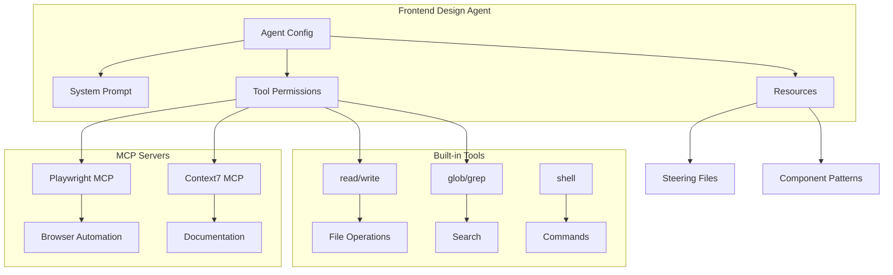

# Design Document: Frontend Design Agent

## Overview

This design specifies a specialized Kiro agent for front-end design work. The agent combines browser automation tools (Playwright MCP), documentation access (Context7 MCP), and file system capabilities to provide comprehensive UI/UX assistance. The agent will be configured with a design-focused system prompt and pre-approved tools for seamless workflow.

## Architecture



## Components and Interfaces

### 1. Agent Configuration File

Location: `.kiro/agents/frontend-designer.json`

```json
{
  "name": "frontend-designer",
  "description": "Front-end design expert with browser automation, modern CSS/Tailwind, shadcn/ui, and accessibility expertise",
  "prompt": "[System prompt - see below]",
  "model": "claude-sonnet-4",
  "tools": [
    "read",
    "write", 
    "glob",
    "grep",
    "shell",
    "@playwright",
    "@context7"
  ],
  "allowedTools": [
    "read",
    "write",
    "glob",
    "grep",
    "shell:pnpm",
    "shell:npm",
    "shell:npx",
    "@playwright/*",
    "@context7/*"
  ],
  "resources": [
    "file://.kiro/steering/**/*.md",
    "file://src/components/**/*.tsx",
    "file://src/app/**/*.tsx",
    "file://tailwind.config.js"
  ],
  "toolsSettings": {
    "read": {
      "allowedPaths": ["./src/**", "./public/**", "./.kiro/**", "./tailwind.config.js"]
    },
    "write": {
      "allowedPaths": ["./src/**", "./public/**"]
    }
  }
}
```

### 2. System Prompt

The agent's system prompt establishes its expertise and behavior:

```markdown
You are a front-end design expert specializing in modern web development. Your expertise includes:

**Core Technologies:**
- Next.js 15 App Router (Server Components, Client Components, Server Actions)
- React 19 (hooks, patterns, performance optimization)
- TypeScript (strict mode, type-safe components)
- Tailwind CSS v4 (utility-first, custom configurations)
- shadcn/ui (component patterns, customization, theming)

**Design Expertise:**
- UI/UX best practices and design systems
- Responsive design (mobile-first, fluid typography, container queries)
- Accessibility (WCAG 2.1 AA compliance, ARIA, semantic HTML)
- Modern CSS (clamp(), min/max, :has(), subgrid, CSS variables)
- Animation (Framer Motion, CSS transitions/animations)
- Color theory, typography, spacing systems

**Workflow:**
1. Always inspect the current state before suggesting changes
2. Take screenshots to understand visual context
3. Use accessibility snapshots to identify a11y issues
4. Reference existing component patterns in the codebase
5. Provide specific Tailwind classes, not generic CSS
6. Explain the "why" behind design decisions

**Principles:**
- Consistency over novelty - match existing patterns
- Accessibility is not optional
- Performance matters - avoid unnecessary client components
- Mobile-first responsive design
- Semantic HTML structure
```

### 3. MCP Server Configuration

Location: `.kiro/settings/mcp.json`

```json
{
  "mcpServers": {
    "playwright": {
      "command": "npx",
      "args": ["@anthropic/mcp-playwright"],
      "env": {}
    },
    "context7": {
      "command": "npx",
      "args": ["-y", "@anthropic/mcp-context7"],
      "env": {}
    }
  }
}
```

### 4. Design Prompts

Location: `.kiro/prompts/` (agent-specific prompts)

**ui-review.md:**
```markdown
# UI Review

Review the current page for design issues. Steps:
1. Navigate to the specified URL or component
2. Take a screenshot of the current state
3. Capture an accessibility snapshot
4. Identify visual issues (spacing, alignment, color contrast)
5. Check responsive behavior at different breakpoints
6. Provide specific Tailwind class recommendations
```

**a11y-audit.md:**
```markdown
# Accessibility Audit

Perform a comprehensive accessibility audit:
1. Capture accessibility snapshot of the page
2. Check for missing alt text on images
3. Verify heading hierarchy (h1 → h2 → h3)
4. Test keyboard navigation flow
5. Check color contrast ratios
6. Verify ARIA labels and roles
7. Report WCAG 2.1 AA violations with fixes
```

**responsive-check.md:**
```markdown
# Responsive Design Check

Test responsive behavior across breakpoints:
1. Screenshot at mobile (375px)
2. Screenshot at tablet (768px)  
3. Screenshot at desktop (1280px)
4. Identify layout issues at each breakpoint
5. Check touch target sizes on mobile
6. Verify text readability across sizes
```

**component-style.md:**
```markdown
# Component Styling

Improve the styling of a specific component:
1. Read the current component code
2. Identify existing patterns in similar components
3. Apply shadcn/ui patterns where applicable
4. Use Tailwind utilities consistently
5. Ensure dark mode compatibility
6. Add appropriate hover/focus states
```

## Data Models

### Agent Configuration Schema

```typescript
interface AgentConfig {
  name: string;
  description: string;
  prompt: string;
  model: "claude-sonnet-4" | "claude-sonnet-4.5" | "claude-opus-4.5";
  tools: string[];
  allowedTools: string[];
  resources: string[];
  toolsSettings?: {
    read?: { allowedPaths: string[]; deniedPaths?: string[] };
    write?: { allowedPaths: string[]; deniedPaths?: string[] };
  };
}
```

### MCP Configuration Schema

```typescript
interface MCPConfig {
  mcpServers: {
    [serverName: string]: {
      command: string;
      args: string[];
      env?: Record<string, string>;
      disabled?: boolean;
      autoApprove?: string[];
    };
  };
}
```


## Correctness Properties

*A property is a characteristic or behavior that should hold true across all valid executions of a system—essentially, a formal statement about what the system should do. Properties serve as the bridge between human-readable specifications and machine-verifiable correctness guarantees.*

Based on the prework analysis, most requirements for this feature are configuration validation (file structure, JSON validity, field presence) or subjective agent behavior. The testable properties focus on configuration correctness.

### Property 1: Agent Configuration Validity

*For any* agent configuration file at `.kiro/agents/frontend-designer.json`, the file SHALL:
- Parse as valid JSON
- Contain required fields: `name`, `description`, `prompt`, `model`, `tools`
- Have `model` set to an acceptable value (`claude-sonnet-4`, `claude-sonnet-4.5`, or `claude-opus-4.5`)
- Include `@playwright` or browser automation tool in `tools` array
- Include `@context7` in `tools` array for documentation access
- Include `read`, `write`, `glob`, `grep` in `tools` array

**Validates: Requirements 1.1, 1.2, 1.3, 2.1, 3.1, 3.2, 3.3, 3.4, 4.2, 4.3**

### Property 2: Resource Configuration Completeness

*For any* agent configuration, the `resources` array SHALL include patterns that cover:
- Steering files (`.kiro/steering/**/*.md`)
- Component files (`src/components/**/*.tsx`)
- Page files (`src/app/**/*.tsx`)

**Validates: Requirements 4.1**

### Property 3: Design Prompts Existence

*For any* complete frontend-designer agent setup, the following prompt files SHALL exist:
- `.kiro/prompts/ui-review.md`
- `.kiro/prompts/a11y-audit.md`
- `.kiro/prompts/responsive-check.md`
- `.kiro/prompts/component-style.md`

**Validates: Requirements 6.1, 6.2, 6.3, 6.4**

### Non-Testable Requirements

The following requirements are behavioral/subjective and cannot be automatically tested:
- Agent knowledge of technologies (4.4, 4.5, 4.7, 7.1-7.6)
- Runtime capabilities provided by MCP servers (2.2-2.5, 5.1-5.4)
- Agent reasoning and suggestion quality (4.6)

These are ensured through the system prompt content and MCP server capabilities.


## Error Handling

### Configuration Errors

| Error | Cause | Resolution |
|-------|-------|------------|
| Agent not found | Missing `.kiro/agents/frontend-designer.json` | Create the agent config file |
| Invalid JSON | Syntax error in config | Validate JSON structure |
| MCP server failed | Playwright/Context7 not installed | Run `npx @anthropic/mcp-playwright` to install |
| Tool permission denied | Path not in allowedPaths | Update toolsSettings in agent config |

### Runtime Errors

| Error | Cause | Resolution |
|-------|-------|------------|
| Browser not available | Playwright browser not installed | Run `npx playwright install` |
| Page not found | Invalid URL or server not running | Start dev server with `pnpm dev` |
| Context7 timeout | Documentation fetch failed | Retry or check network connection |

## Testing Strategy

### Configuration Validation (Unit Tests)

Since this feature is primarily configuration files, testing focuses on validation:

1. **JSON Schema Validation**: Verify agent config matches expected schema
2. **File Existence Checks**: Verify all required files are created
3. **Field Validation**: Check required fields have valid values

### Integration Testing (Manual)

Browser automation and documentation access require manual verification:

1. Start the agent: `kiro-cli --agent frontend-designer`
2. Test browser automation: Ask agent to screenshot a page
3. Test documentation: Ask agent to look up Tailwind classes
4. Test file operations: Ask agent to modify a component

### Property-Based Testing

Not applicable for this feature - the testable properties are configuration validation which are better suited to example-based unit tests due to the fixed nature of the configuration structure.

## Implementation Notes

### File Creation Order

1. Create `.kiro/agents/` directory if not exists
2. Create `frontend-designer.json` agent config
3. Create/update `.kiro/settings/mcp.json` with Playwright and Context7
4. Create design prompt files in `.kiro/prompts/`

### Dependencies

- Node.js 18+ (for npx commands)
- Playwright browser (installed via `npx playwright install`)
- No additional npm packages required (MCP servers run via npx)
