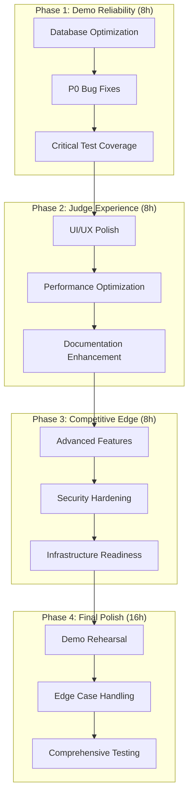

# Design Document: Hackathon Optimization Sprint

## Overview

This design implements a 48-hour optimization sprint to transform DriverOS from 80% hackathon-ready to 95% demo-perfect. The approach prioritizes maximum impact fixes through four strategic phases.

## Architecture



## Phase Breakdown

### Phase 1: Demo Reliability (Hours 0-8)
**Goal**: Ensure zero crashes during live demo

**Critical Path Dependencies:**
- Database indexes must be applied before performance testing
- Memory leak fixes required before stress testing
- Rate limiting needed before API testing

**Success Metrics:**
- Leaderboard loads in <2s
- No memory growth during 10-minute demo
- API endpoints handle 100 concurrent requests

### Phase 2: Judge Experience (Hours 8-16)
**Goal**: Professional impression and smooth evaluation

**Dependencies:**
- Phase 1 performance fixes enable UI optimization
- Accessibility improvements require stable base
- Documentation builds on working features

**Success Metrics:**
- WCAG 2.1 AA compliance
- Mobile navigation works on touch devices
- 3-command setup verified on fresh machine

### Phase 3: Competitive Edge (Hours 16-24)
**Goal**: Stand out from other submissions

**Dependencies:**
- Stable foundation from Phases 1-2
- Advanced features require solid base
- Security hardening needs working system

**Success Metrics:**
- Health monitoring active
- Error tracking implemented
- Backup deployment ready

### Phase 4: Final Polish (Hours 24-48)
**Goal**: Perfect demo execution

**Dependencies:**
- All previous phases complete
- Demo script requires working features
- Edge cases need stable system

**Success Metrics:**
- Demo completes in 7 minutes
- 95% test success rate
- Judge setup works in 3 minutes

## Data Models

### Task Priority Schema

```typescript
interface Task {
  id: string;
  phase: 1 | 2 | 3 | 4;
  priority: 'P0' | 'P1' | 'P2';
  estimatedHours: number;
  dependencies: string[];
  acceptanceCriteria: string[];
  riskLevel: 'LOW' | 'MEDIUM' | 'HIGH';
  impactScore: number; // 1-10
}
```

### Performance Targets

```typescript
interface PerformanceTargets {
  pageLoadTime: number; // <2000ms
  apiResponseTime: number; // <500ms
  testSuiteTime: number; // <300s
  demoTotalTime: number; // <420s (7 minutes)
  setupTime: number; // <180s (3 minutes)
}
```

## Component Architecture

### Database Optimization Layer

```typescript
// Optimized query patterns
interface OptimizedQueries {
  leaderboard: () => Promise<ModelWithStats[]>;
  activityFeed: (limit: number) => Promise<TradeCard[]>;
  comparisonData: (engineIds: string[]) => Promise<ComparisonData>>;
}
```

### Error Boundary System

```typescript
interface ErrorBoundaryProps {
  fallback: React.ComponentType<{error: Error}>;
  onError?: (error: Error, errorInfo: ErrorInfo) => void;
  children: React.ReactNode;
}
```

### Performance Monitoring

```typescript
interface PerformanceMetrics {
  pageLoadTime: number;
  apiLatency: Record<string, number>;
  memoryUsage: number;
  errorRate: number;
}
```

## Integration Points

### Database Layer
- Apply indexes without downtime
- Migrate existing queries to optimized patterns
- Add performance monitoring hooks

### API Layer
- Implement rate limiting middleware
- Add error boundaries and validation
- Include health check endpoints

### UI Layer
- Enhance accessibility attributes
- Optimize animation performance
- Improve mobile responsiveness

### Testing Layer
- Expand unit test coverage
- Add performance benchmarks
- Include demo scenario tests

## Risk Mitigation

### High-Risk Areas
1. **Database Migration**: Index application could lock tables
2. **Memory Leaks**: Fixing intervals might break functionality
3. **UI Changes**: Accessibility fixes could alter visual design
4. **Performance**: Optimizations might introduce new bugs

### Mitigation Strategies
1. **Backup Strategy**: Git branches for each phase
2. **Rollback Plan**: Quick revert procedures
3. **Testing Gates**: Validation at each phase boundary
4. **Demo Backup**: Video recording of working state

## Success Criteria

### Phase Gates
- **Phase 1**: Performance tests pass, no memory leaks
- **Phase 2**: Accessibility audit passes, mobile works
- **Phase 3**: Health checks active, monitoring working
- **Phase 4**: Demo rehearsal successful, tests green

### Final Acceptance
- Judge setup completes in <3 minutes
- Demo runs smoothly in <7 minutes
- All critical tests pass
- Performance targets met
- Documentation complete
